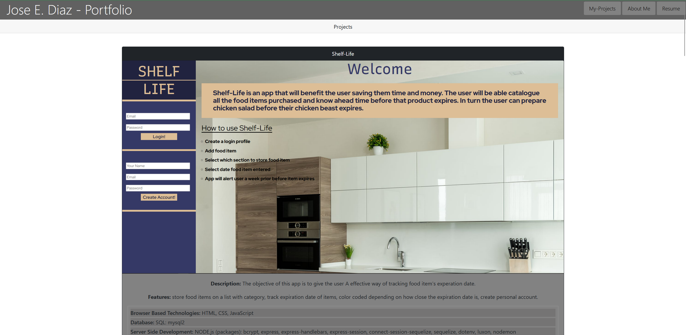

# jd-portfolio

## Description

Create a portfolio single-page application, using React.

## Usage
Live Site: https://hotsoup42.github.io/jd-portfolio/

## License

## Badges

## contact
Github: https://github.com/hotsoup42/jd-portfolio

## Futher Development
will be updated regulary as projects get updated/created.
